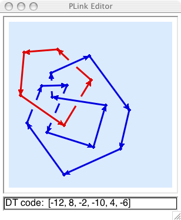

.. Documentation of the plink part of SnapPy

Using SnapPy's link editor
=================================

PLink draws piecewise linear link projections.  Components may be
points, PL arcs, or PL circles.  Line segments are oriented consistently in
each component.  Different components are different colors.

To invoke the link editor, do::

  In[5]:  M = Manifold()

Once you've drawn the link, select the menu item "PLink->Tools->Send to
SnapPy", and then *M* will be the complement of the link.  If you edit
the link, you can again do "Send to SnapPy" to update *M*.  

Drawing Basics
------------------------------

* When using the mouse to draw a link with PLink, you should always
  *click-and-release*.  Do not hold the mouse button down while drawing.
  PLink requires only the left mouse button.
 
* The default state of the editor is indicated by the arrow cursor.
  In this state, click-and-release the left mouse button on the
  background to place a starting vertex and begin drawing.  The vertex
  will be connected to the pencil cursor by a thin red line.
  Click-and-release to place a second vertex.  The two vertices will
  then be joined by an edge. Continue to draw other vertices and edges
  to your heart's content.

* To stop drawing, either click twice on the same vertex to create an
  arc, or click on an endpoint vertex.  The latter operation will
  either create a circle component or join together two arc
  components.

* When the cursor hovers over a vertex it changes to the pointing
  finger.  From this state you can drag a vertex to a new location
  with a click-and-release on the vertex. The vertex will become
  enclosed in a circular cursor.  Move it to where you want it to go
  and click the left (or middle) button to place it.  If you drag one
  endpoint on top of another, they will meld.

* When the cursor hovers over an edge, not too close to a vertex or
  crossing, it changes to the push-me-pull-you cursor.  Clicking in
  this state will change the orientation of the component containing
  the edge.

* When the cursor hovers over a crossing it changes to the yin-yang
  recycling cursor.  Clicking while in this state changes the the
  handedness of the crossing.

* Double-clicking on an endpoint vertex will restart drawing from
  that vertex.  Double-clicking on a non-endpoint vertex will break
  the link at that point and begin drawing with the old incoming edge.

* While in drawing state, hitting the Delete key removes the last
  vertex before the cursor.  If no vertices remain, the drawing state
  ends and the active component is removed.  This can be used to
  remove a segment from the diagram.  Double-click a vertex; hit
  Delete to remove the incoming segment at that vertex; then click the
  vertex again to reconnect.

* You will not be allowed to create edges that pass too close to a
  vertex or a crossing, or to place vertices too close to edges or to
  crossings or to other vertices.  If you attempt to do any of these
  things, PLink will flash the drawing canvas.

Miscellaneous Features
---------------------------------

The window can be resized to allow for different sizes of link
projections, and the arrow keys can be used to slide the projection
around in order to make more room on one side or another.

The "Tools" menu can be used to make the projection alternating
(provided that all components are circles), or to clear the screen,
or to reflect the projection in the xy-plane, changing all crossings.
Also, the "Tools" menu includes the "send to SnapPy" command.

The "File" menu can be used to save the projection as a SnapPea
link projection file.  (This can be done from the drawing state as
well, in which case the "hot vertex" is remembered in the file!).  The
"File->Open File" command will read a SnapPea link projection file,
and restart drawing if the projection was saved while drawing.

The "Info" menu selects information about the link projection to be
displayed in the info line at the bottom.  Various encoding schemes
for link projections are supported, as well as the blackboard framing
curves, expressed in meridian-longitude coordinates.  Cutting and
pasting from the info line is supported.  The numerical and
alphabetical Dowker-Thistlethwaite codes are displayed in an extended
form which includes a full description of the planar embedding.  The
string printed in the info line is also accepted as input to SnapPy's
Manifold constructor.  Paste the DT code between the apostrophes in
Manifold('').  The "DT labels" option displays the indexing used in
computing the Dowker-Thistlethwaite codes.
